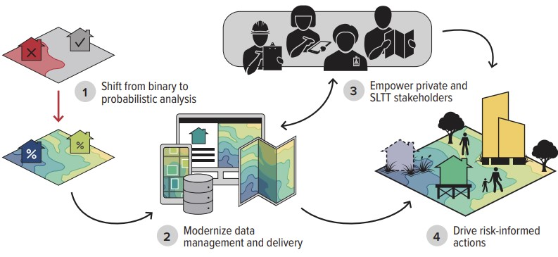

# About FFRD

FEMA’s Future of Flood Risk Data (FFRD) initiative aims to provide a more comprehensive picture of the country's flood hazards and risks. It focuses on delivering efficient, accurate, and consistent flood risk with uncertainty nationwide. This set of documents is intended to improve collaboration among stakeholders and document the development of tools that can be used within the FFRD initiative. By utilizing standardized data formats, detailed specifications, structured schemas, and reference implementations, the tools developed will serve as a foundation for studies and analyses that further enhance flood risk assessment and management. These efforts will aid in ensuring better preparedness and resilience across communities, ultimately supporting informed decision-making and policy development.

## More information
* [The Future of Flood Risk Data (FFRD)](https://www.fema.gov/print/pdf/node/578088)
* [FEMA's Future of Flood Risk Data Initiative](https://www.hec.usace.army.mil/confluence/hecnews/spring-2023/fema-s-future-of-flood-risk-data-initiative)
  _(US Army Corps of Engineers)_
* [CTP Webinar: FEMA's Future of Flood Risk Data Initiative](https://floodsciencecenter.org/event/ctp-webinar-femas-future-of-flood-risk-data-initiative/)
  _(Association of State Floodplain Managers)_
